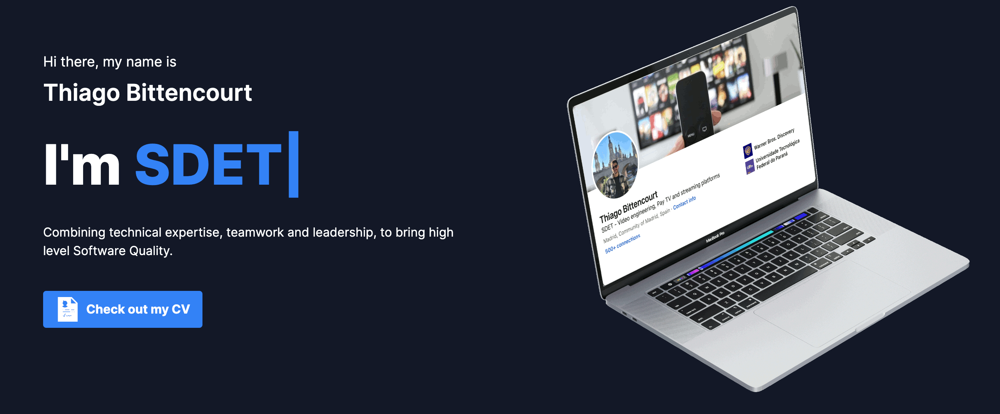

<!-- PROJECT LOGO -->
<br />
<div align="left">
  <div align="center">
  <a href="https://github.com/othneildrew/Best-README-Template">
    
  </a>
  </div>

  <h3 align="left">My Personal Page</h3>

  <p>
    I have made this project to start exploring different tools and framework for web development.
    <ul>
      <li>
    Frontend: Svelte    
      </li>
    <li>
      Backend: Sveltekit
    </li>
    <li>
    SkeletonUI: Superset of Tailwind for Svelte
    </li>
    <li>
    Deploy: Netify
    </li>
    </ul>
    <br />
    <a href="https://thiago-bittencourt.netlify.app/"><strong>Check out the page here</strong></a>
    <br />
</div>


### Built With

This section should list any major frameworks/libraries used to bootstrap your project. Leave any add-ons/plugins for the acknowledgements section. Here are a few examples.


* [![Svelte][Svelte.dev]][Svelte-url]


## Getting Started


### Prerequisites

Install node
  ```sh
  npm install npm@latest -g
  ```

### Installation

1. Clone the repo
   ```sh
   git clone https://github.com/bittersoftware/my-personal-page-svelte.git
   ```
2. Install NPM packages
   ```sh
   npm install
   ```
3. Enter your Githu API in `.env`
   ```sh
   PRIVATE_GITHUB_API=YOUR_API
   ```
4. Run the server
   ```sh
   npm run dev
   ```
<p align="right">(<a href="#readme-top">back to top</a>)</p>


<!-- ROADMAP -->
## Roadmap

- [ ] Translate My Stuff page
- [ ] Scroll to the top when changing routes
- [ ] Improve performance to load iframe in My Stuff > YouTube embedded videos
- [ ] Add urls for projects in Home > Carousel
- [ ] Make Hero less terrible in different screen resolutions

<!-- CONTACT -->
## Contact

Thiago - [@thiagobitten](https://twitter.com/thiagobitten)


<p align="right">(<a href="#readme-top">back to top</a>)</p>

